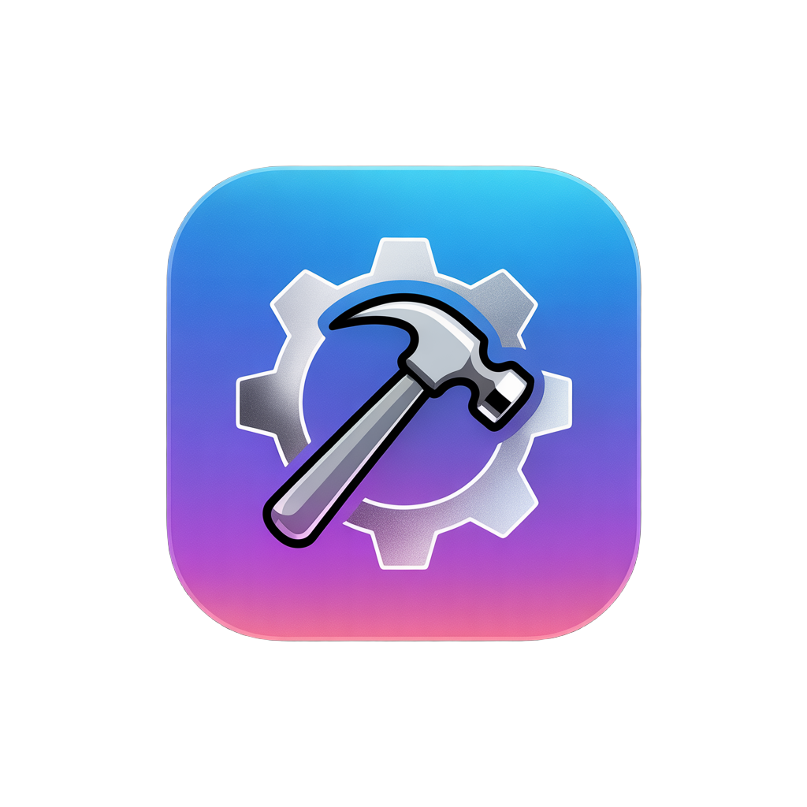

<p align="center">
  
</p>

<h1 align="center">XcodeHelper</h1>

<p align="center">
A menu bar utility for macOS that gives you global keyboard shortcuts for common Xcode actions.<br>
No Dock icon, no bloat. It sits in your menu bar and does exactly two things well.
</p>

<p align="center">
  
</p>

## What It Does

**Build & Run** — Triggers a build-and-run in Xcode from wherever you are. It uses AppleScript to tell Xcode to run the active workspace document directly, so your current scheme and simulator selection are always respected.

**Clean Derived Data** — Nukes everything in `~/Library/Developer/Xcode/DerivedData`. Handles individual file errors gracefully (locked files from active builds get skipped and reported). The directory itself is preserved.

Both actions give you macOS notification feedback on success or failure.

## Installation

macOS 13 (Ventura) or later.

```bash
git clone https://github.com/your-username/xcode-improvement.git
cd xcode-improvement
make install
```

That builds a release binary via Swift Package Manager, bundles it into `XcodeHelper.app`, and drops it in `/Applications`. Launch it from Spotlight and look for the hammer icon in your menu bar.

## Keyboard Shortcuts

| Action | Default Shortcut |
|--------|-----------------|
| Build & Run | Ctrl + Cmd + R |
| Clean Derived Data | Ctrl + Cmd + Shift + K |

Both are customizable through the Preferences menu. There's a reset-to-defaults button if you get yourself into trouble.

## Permissions

macOS will prompt you for two things on first launch:

1. **Notifications** for success/failure feedback
2. **Automation** so AppleScript can control Xcode

All manageable in System Settings > Privacy & Security. If a permission is missing, XcodeHelper will send a notification you can click to jump straight to the relevant Settings pane. You can also use **Fix Permissions...** from the menu bar dropdown at any time.

## Build Targets

```bash
make build     # Release binary only
make bundle    # Binary + .app bundle
make install   # Full build + copy to /Applications
make clean     # Remove build artifacts
```

## Under the Hood

**Build & Run** checks whether Xcode is running via `NSWorkspace`, then uses AppleScript to activate Xcode and run the frontmost workspace document. No System Events or simulated keystrokes involved — it talks to Xcode's scripting interface directly. If Automation permission hasn't been granted, you'll get an actionable notification that opens System Settings.

**Clean Derived Data** uses `FileManager` to remove the contents of the DerivedData directory. Files locked by an active build are skipped, and the count of skipped files is reported via notification.

**Global hotkeys** are powered by [KeyboardShortcuts](https://github.com/sindresorhus/KeyboardShortcuts) by Sindre Sorhus.

## License

MIT